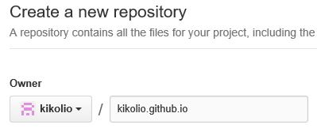
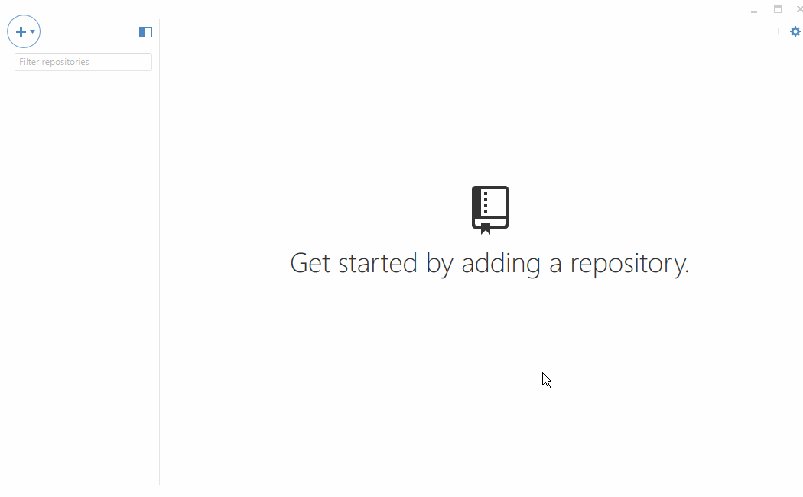
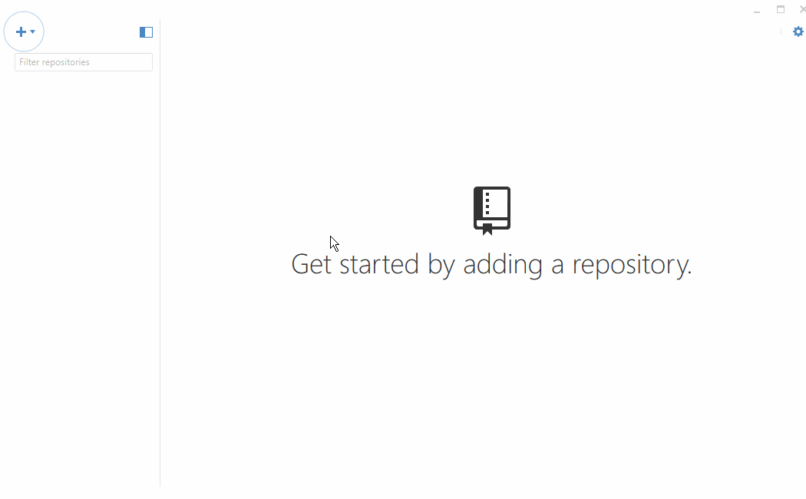
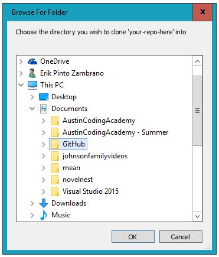

# Environment Setup

## Setting up your local environment

These are instructions for setting up a local environment to build websites. If you set this up, you will have the ability to build and test your personal projects without needing internet access. 

### Light-weight code editor

Install [Brackets](http://brackets.io/) on your laptop (Mac or Windows). The installation is pretty straightforward. Once the installation is completed and you have run Brackets for the first time it will look something like this:

Once Brackets is installed, I recommend the installation of the extension: `Beautify - Format JavaScript, HTML, and CSS files.`

How to install **Beautify** extension:

### GitHub 

Create an account on [GitHub](http://www.github.com). Remember your credentials because you are going to need them later. Once you are signed in, look for the green button on the right that says `+ New repository`

Type a repository name using the following scructure; `username.github.io` where `username` is your GitHub username. For example my username is `kikolio` therefore my repository name is going to be `kikolio.github.io.`

> Remember - It has to have your username not mine!

Install [GitHub Desktop](https://desktop.github.com/) in your computer. Run the app and sign in using your GitHub credentials - you will only do this step once. To login click on the `gear` on the top right corner, click on `option`, and lastly click on `+ Add account`. Enter your GitHub credentials one more time and click `login`.

To clone your repository click on the plus sign on the top left corner and choose clone.  A list of repositories you have access will show up. In your case it might only be the one you created above. Select it and click on clone.

You will be asked where do you want to save your project. To keep consistency, save it under GitHub folder in your documents.

Your repository will be added to list on GitHub Desktop and an empty folder with the name of your repository is under GitHub folder. Note that the folder is not really empty. If you have the option of seeing hidden folder/files, you will see a folder called `.git`. It contains the information about your repository - **do not delete it or make any change.**

Each change you made to that folder by adding files/folder or changing the content of those will be reflected on GitHub Desktop as an uncommitted change.

In this repository you will be creating a new folder for each homework and project during this session.
    
### Folder structure for class exercises

Please follow the folder structure I present; this is not required but it would help me to help you in the long run. In your documents folder, create a folder and name it `AustinCodingAcademy`. Notice that it has no spaces.

As you add more exercises, add them all to the "AustinCodingAcademy" folder. When you are done, you will have an organized folder structure like this:

/documents 
&nbsp;&nbsp;&nbsp;/AustinCodingAcademy 
&nbsp;&nbsp;&nbsp;&nbsp;&nbsp;&nbsp;/exercise-1 
&nbsp;&nbsp;&nbsp;&nbsp;&nbsp;&nbsp;/exercise-2 
&nbsp;&nbsp;&nbsp;&nbsp;&nbsp;&nbsp;/exercise-3 
&nbsp;&nbsp;&nbsp;&nbsp;&nbsp;&nbsp;... 

> It is important to note that these are just **examples** of folder names. These folders will be added as we process in class

### Opening exercise/project folders on Brackets

Now that we have Brackets installed, a folder structure, and a repository cloned, we can open any of those folders within Brackets This will allow us to access files and folders within the project easily. We can create files and folders according to our needs.

