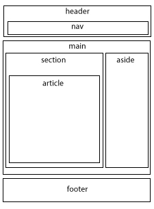

# HTML5 - Semantic Elements

### Objective

* Review HTML concepts
* Structure your website to be semantically correct
* Semantic element vs div container

### Reading

* [Semantic HTML](https://en.wikipedia.org/wiki/Semantic_HTML)
* [W3School -  Semantic HTML5](http://www.w3schools.com/html/html5_semantic_elements.asp)
* [HTML5 semantic elements](http://vanseodesign.com/web-design/html5-semantic-elements/)
* [HTML5 semantics](http://www.smashingmagazine.com/2011/11/html5-semantics/)

# Instruction Plan 

### Engage 

Now that we know how to write HTML by having the ability to place the content on the page is part of being a good front-end developer. Being able to write HTML semantically brings benefits into the development process not just for you but for future developers who might have to read or modify your content. Some of those benefits are easy-to-use, accessible, SEO friendly, and repurpose.

### Explore

Visit [http://www.telogis.com/](http://www.telogis.com/) and view its source code. What new element do you see? 

Was it easy to realize what to expect on some of the elements?  

## Explain 

Let me expand on the benefits of writing HTML semantically. Let's start with easy-to-use. The use of HTML elements gives the developer the possibility of writing fewer attributes and avoiding inline styles (will be covered in CSS). All of this makes your code less clumsy. If some developer has to read or edit your code, he/she will have an easy interaction with it since he/she won't waste time on trying to figure out how it works. Plus, your code will be condensed, thereby making the file load faster.

```html
<div id="main">
    <div id="section">
        <div id="article"></div>
    </div>
    <div id="aside"></div>
</div>
<div id="footer">
</div>
```

```html
<main>
    <section>
        <article></article>
    </section>
    <aside></aside>
</main>
<footer>
</footer>
```

Many of us only consume the web through the web browser, but there is a portion of the world that does not. Many of them use screen readers, need to print the page, use monochrome screens, or another accommodation for some kind of disability. In those cases it not so much how the content is presented but how it is structured. Imagine a website without having the CSS running having no style and know that the page should still be understood for those agents that are consuming your HTML page. 

```html
<p>Lorem <b>ipsum</b> dolor sit <i>amet.</i></p>
```
```html
<p>Lorem <strong>ipsum</strong> dolor sit <em>amet.</em></p>
```


### Elaborate

We are going to create a webpage that uses the following semantic elements:

* nav
* main
* section
* aside

### Evaluate 

There was a miscommunication in our team, the developer that was working on the HTML part of the project created a website not using semantic elements, but the designer that worked on the CSS file did work using semantic type selectors. Now the website doesn't look the way it should. Please help us out!

I've attached our website to this [link](https://github.com/AustinCodingAcademy/HTMLIntroductory/raw/master/archives/02/exercise/exercise.zip)

**Class discussion**

### Homework 

You've been hired to build the landing page for the Daily Planet newspaper. You will be working alongside with a designer that already worked on the CSS. As requirements all you need to do is to make sure you have the following elements on your page:

* header
* nav
* main
* section
* article
* aside
* footer

My designer told me that the structure should look like this image



And here is the list of requirements for the page:
* For the header part we need it to say 'Daily Planet'
* Navigation to three news section - Sports, Local, Economics.
* The front page has the news related to the massive migration from Syria to northern european countries.
* We have two  sponsors, H.E.B and General Electric. Also show that we have news about the presidential campaign.
* Footer only has the copyright of our company and the current year.

Download your Homework initial files [here](https://github.com/AustinCodingAcademy/HTMLIntroductory/raw/master/archives/02/homework/daily-planet.zip)
