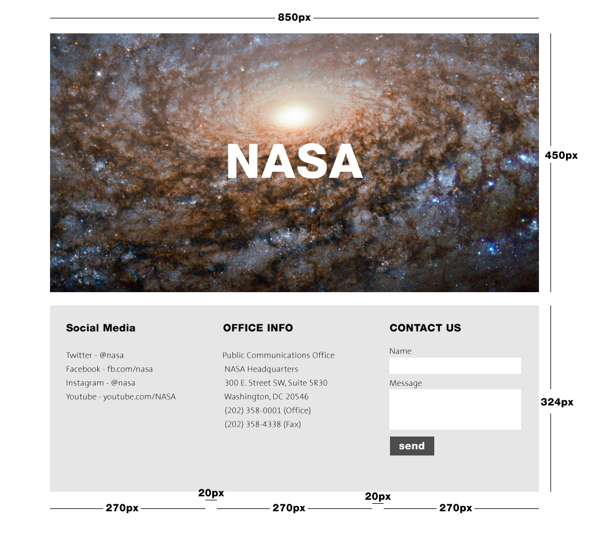

# Float and Clear

### Objective

* Learn how to break the normal document flow
* Restore normal document flow
* Learn how to detect problems when using floats

### Reading
* [CSS Trick - All About floats](https://css-tricks.com/all-about-floats/)
* [A list apart - CSS float 101](http://alistapart.com/article/css-floats-101)

# Instructional Plan

### Engage

So far we have been able to get the content structured and the elements to look the way we want but we havent been able to change the way elements are organize on the page. So far everything is stack on top of another or goes with the `normal document flow`. That is because container elements (`div`, `section`, `footer`, etc) are block level elements.

### Explore

Visit any website and open the developer tool. Look for elements that are not within the `normal document flow`. Those elements appears to be order horizontally instead of vertically.

### Explain

Float allows to elements to be placed to the left or right of its containing block. What allow us to change the flow of the elements is a CSS property named `float` and it has 2 possible values `right` and `left`. To return to the normal document flow for the rest of the elements is the use of the property `clear`. `clear` has three possible values `left`, `right`, and `both`.

### Elaborate

#### Float

```html
<style>
    .my-element {
        width: 300px;
        height: 600px;
        float: left;
    }
</style>

<section>
    <div class="my-element">
        <p>A float is a box that is shifted to the left or right on the current line.</p>
    </div>
    <div class="my-element">
        <p>
            Content flows down the right side of a left-floated 
            box and down the left side of a right-floated box.
        </p>
    </div>
</section>
```

#### Clear

```html
<style>
    div {
        width: 300px;
        height: 600px;
    }
    .my-element {
        float: left;
    }
    
    .my-news {
        clear: left;
    }
</style>

<section>
    <div class="my-element">
        <p>A float is a box that is shifted to the left or right on the current line.</p>
    </div>
    <div class="my-element">
        <p>
            Content flows down the right side of a left-floated box and down the left
            side of a right-floated box.
        </p>
    </div>
    <div class="my-news">
        <p>
            This weekend, when you look into the night sky you will be able to see a 
            blood red, larger-than-life moon projecting against the stars; the first 
            in more than 30 years.
        </p>
    </div>
</section>
```

With the use of float comes some side effects

**Container collapse**

It occurs when the parent element cannot see the children because they are removed from the normal document flow, so it collapses up until it finds an element that is part of the normal flow. If not, then it collapses entirely.

**Column collapse**

A column collapse happens when the floating element runs out of space from its parent container so that the element(s) will resume in another line.

### Evaluate

**Float**

Here is the [initial file](../exercises/05/evaluate.html) to work on.
Follow the steps the instructor will be dictating during class.

**Clear**

Here is the [initial file](../exercises/05/evaluate-2.html) to work on.
Follow the steps the instructor will be dictating during class.

### Exercise

Download this initial [project](../exercises/05/exercise.zip) and start working towards replicating the following website.

Your final result should look like this:


### Homework

**Container collapse**
Fix the following [file](../exercises/05/container-collapse.html) that is facing side effect using CSS float.

**Column collapse**
Fix the following [file](../exercises/05/column-collapse.html) that is facing side effect using CSS float.

**Project**
Download this initial [project](../exercises/05/homework.zip) and start working towards making this website.
You will need to investigate two things:
* How to add a background image to a container element
* How to add text input, textarea, and button element

Your final result should look like this:


