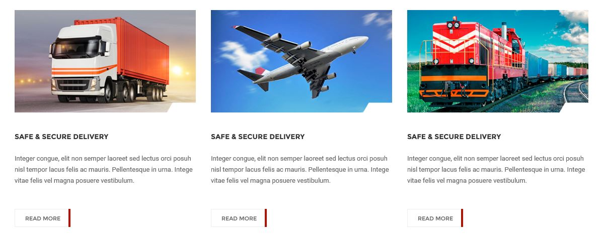
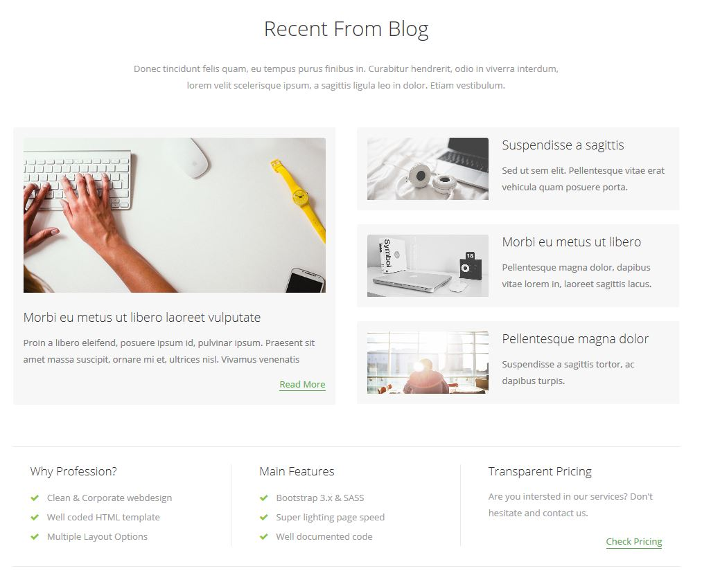

# Box Model

### Objectives
* Learn how each element is encapsulated in its own box
* Learn how to manipulate each property of the Box Model
* Learn what is container block
* Learn what is content block

### Reading

* [W3School - Box Model](http://www.w3schools.com/css/css_boxmodel.asp)

# Instruction Plan

### Engage

Have you noticed that everything we have done so far has followed a certain flow with regard to positioning of the elements? Almost like if they were `boxes`. The way elements stack we call `normal document flow` and the way elements are treated, `Box Model`. The properties of the box model affect the way elements look on a page but also affect surrounding elements. The use of these properties can be tricky sometimes when in use. If you don’t know what frustration is, CSS will make sure you know.

### Explore

Visit one of your favorites and open the developer tool and inspect an element of your interest. We've seen the styles applied listed on the right panel. There is another panel called `Computed`, click it and you should be presented with a multicolored box.


### Explain

The 4 properties of the box model are `dimension` (width/height), `padding`, `border`, and `margin`.

**Dimension** - By default it's the size of the content contained within the element. To set the dimension you can use width and height as the property and as values pixels, percentages, etc.

```css
    .box-model {
        width: 250px;
        height: 50%; /* 50% of the available space*/
    }
```

**Padding** - It is the space between the border and the content contained within it.

```css
    .box-model {
        padding: 20px;
    }
```

**Border** - It is what separates the edge of one element from another. Every box has a border even if it is invisible.

```css
    .box-model {
        border: 1px solid #000;
    }
```

**Margin** - Sits outside of the edge of the border. If you add a value to margin on any side, this addition creates a gap between the border of two elements.

```css
    .box-model {
        margin: 20px;
    }
```

**Content Block** - Dimension (width/height), Padding, and Border. It gives the actual size of the element.

**Containing Block** - Margin + Content block. Represents the space the element needs in the layout - The space that it takes out.

### Elaborate

**Box Model**

Here is the [initial file](../exercises/06/box-model.html) to work on.
Follow the steps the instructor will be dictating during class.

**Overlaping**

Here is the [initial file](../exercises/06/dimensions.html) to work on.
Follow the steps the instructor will be dictating during class.

### Evaluate

Download this initial [project](../exercises/06/exercise.zip) and replicate the following website.



### Homework

Download this initial [project](../exercises/06/homework.zip) and replicate the following website.


