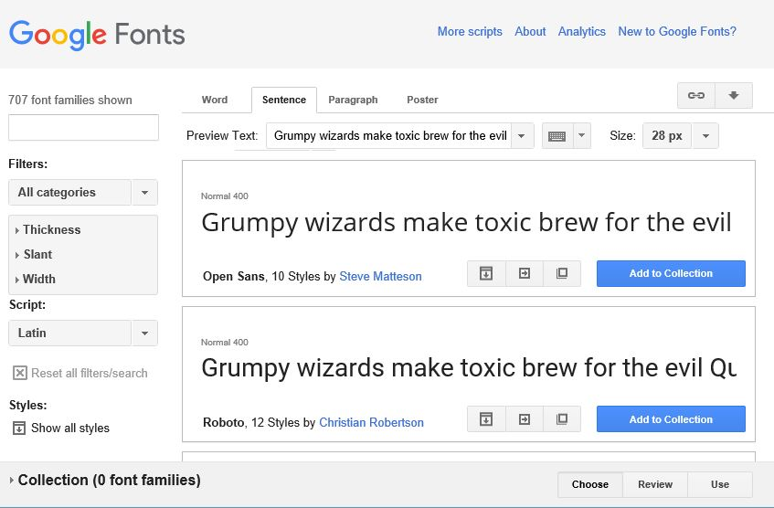
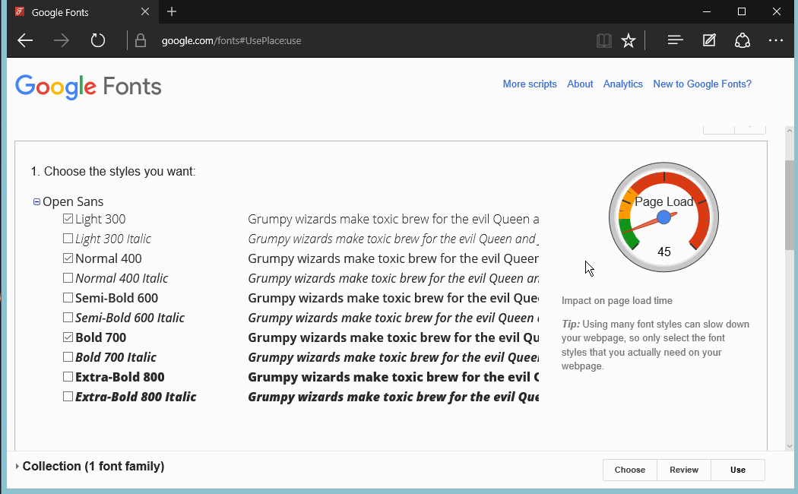

# Hand-on Exercises

### Objectives
* Learn how to import fonts using [Google Fonts](https://www.google.com/fonts)
* Learn how to import a [CSS reset](http://meyerweb.com/eric/tools/css/reset/)
* Implement knowledge gained thus far.

# Reading

* [CSS Best Practices](http://code.tutsplus.com/tutorials/30-css-best-practices-for-beginners--net-6741)
* [How to use heading in HTML](http://cssglobe.com/how-to-use-headings-in-html/)
* [Fonts and Typography](http://www.iraqtimeline.com/maxdesign/basicdesign/principles/prinfont.html)

# Instruction Plan

### Engage

You have survived three weeks of core knowledge on HTML and CSS, congratulation. Now, let's use that knowledge and start creating websites. Repetition is the key of getting better at everything and building websites is not the exception.

You have noticed that we don't have many options when it comes to select a font, we pretty much have the [CSS Web Safe Font](http://www.w3schools.com/cssref/css_websafe_fonts.asp) for us to work with and to be honest it is very limited. Let's find out how we can add more according to our needs.

Have you noticed even though you add no CSS to your webpage things comes with a default style. The `user agent` is providing styles to elements and sometimes is good but sometimes we want to have a maximum control over elements and how we are modifying them. There is pretty cool set of CSS rules used for many developer that will help us to gain that control.


### Explore

Explore any website and inspect any element that has a font that you might think is unusual. Find out how it has been added.

### Explain/Elaborate

**Google Font**

The use of Google Fonts is very simple. Just visit the [website ](https://www.google.com/fonts) and check all the available font they have in the library.



Once you have added to the collection the font you want to use, click on the `use` button at the bottom of the page to choose the style you want


> Dont go over yellow or red on the `Page Load-meter`. If you are adding too many styles there is something wrong with the design of the website.

Now, go down to step 3 and copy the link given to you.



That link you just copied goes on your HTML page. It needs to go before the CSS file is going to utilize that font.

```html
<!DOCTYPE html>
<html>
    <head>
        <title>Awesome website</title>
        <!-- Font from Google Fonts -->
        <link rel='stylesheet' href='https://fonts.googleapis.com/css?family=Open+Sans:400,300,700'>
        <!-- CSS file that is going to utiliza that font -->
        <link rel='stylesheet' href='css/my-style.css'>
    </head>
    <body>
        <!-- HTML Elements-->
    </body>
</html>
```

This is how you'd implement that font on your CSS file

```css

/* my-style.css */

body {
    font-family: 'Open Sans', sans-serif;
}

h3 {
    font-family: 'Open Sans', sans-serif;
    font-weight: 700;
}
```

**CSS Reset**

Create a new CSS file and name it something like css-reset.css and use it on your porjects.Make sure that it goes before any styling you are applying.

```css
html, body, div, span, applet, object, iframe,
h1, h2, h3, h4, h5, h6, p, blockquote, pre,
a, abbr, acronym, address, big, cite, code,
del, dfn, em, img, ins, kbd, q, s, samp,
small, strike, strong, sub, sup, tt, var,
b, u, i, center,
dl, dt, dd, ol, ul, li,
fieldset, form, label, legend,
table, caption, tbody, tfoot, thead, tr, th, td,
article, aside, canvas, details, embed, 
figure, figcaption, footer, header, hgroup, 
menu, nav, output, ruby, section, summary,
time, mark, audio, video {
	margin: 0;
	padding: 0;
	border: 0;
	font-size: 100%;
	font: inherit;
	vertical-align: baseline;
}
```

```html
<!DOCTYPE html>
<html>
    <head>
        <title>Awesome website</title>
        <!-- Remove some style given by the user agen -->
        <link rel='stylesheet' href='css/css-reset.css'>
        <!-- CSS file that contains your style -->
        <link rel='stylesheet' href='css/my-style.css'>
    </head>
    <body>
        <!-- HTML Elements-->
    </body>
</html>
```


### Evaluate

### Homework

# Midterm Project

things to include are:

center page using margin 0 auto
use of github
setting project 

