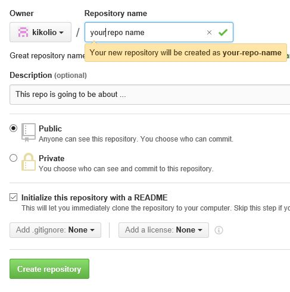
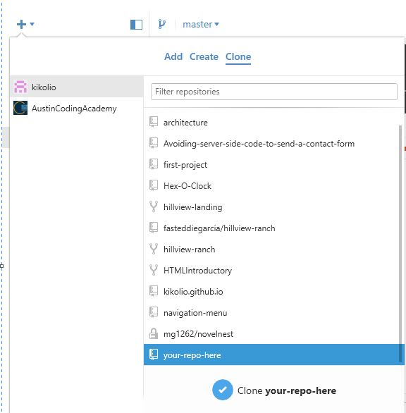
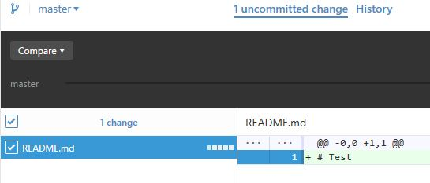
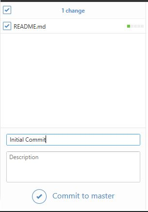
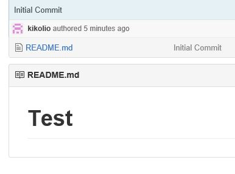

# Midterm Project

### Objective
* Learn how to create a repository in GitHub
* Learn how to clone a repository
* Learn how to push changes
* Learn how to user `username.github.io` to visualize your webpage

### Reading
* [Understanding the GitHub Flow](https://guides.github.com/introduction/flow/index.html)
* [Why You Should Use Git](http://sixrevisions.com/git/why-you-should-use-git/)
* [Markdown Basics](https://help.github.com/articles/markdown-basics/)

# Instruction Plan

### Engage

Imagine that for some reason your laptop stops working and you have not made any backup. What if you are working on a file and you make a huge mistake and can't go back enough to when it was working. Those two scenarios are a nightmare. 
Gladly there is smart solution to that; `GitHub`.

The webpages you have created so far can only be seen on your computer because your files are local. Wouldn't be awesome to
give someone a URL and show what we are capable of doing? When you signed up to GitHub yu gain the change to make that
possible.

### Explore

Take a look to some of these projects hosted on GitHub
* http://kikolio.github.io/
* http://ericaabadu.github.io/
* http://erikamarquez1193.github.io/

### Explain

Head to [GitHub](http://www.github.com) - Make sure you are signed in.

Look for the green button on the right that says `+ New repository`

Type a repository name and a description. If you have spaces in between word in your repository, GitHub will be adding `-` to replace those.
You have the option to be public or private - you need to pay for privates. Make sure you check the `Initialize this repository with a README`. Click on `Create repository`

Make sure you have installed [GitHub Desktop](https://desktop.github.com/). Run the app an sign in using your github credentials - you will only do this step once. Once you are logged in click on the plus sign on the top left corner, then click on clone. A list of repositories you have access will show up. In your case might only be one. Select the one you just created before and click on `clone`.

You will be asked where do you want to save your project. To keep consistency save it under GitHub folder in your documents.

Your repository will be added to list on GitHub Desktop and a empty folder with the name ofyour repository is under GitHub folder. Now that folder is no really empty. If you have the option of seen hidden folder/files you will see a folder called `.git`. It contains the information about your repository - do not delete it or make any change unless you know what you are doing.

Every change you made to that folder by adding files/folder or changing the content of those will be reflected on GitHub Desktop as uncommitted change.

Head over Brackets and open your new repository folder. The one with the name of your repository. Add a file and name it `README.md`. If you already have it don't create a new one. Add content to `README.md` and save.

Whatever you did to `README.md` will show up on GitHub Desktop as 1 uncommitted change.

In order to upload you have changed you will need to commit to those changes by selecting the files you want to commit and adding a comment related to the changes made. Since this is our first commit let's add "Initial Commint" to the summary and the click on `Commit to master`. You can add more information in the description if you'd like.

After that, you need to push your committed changes to your repository by clicking on the `Publish` button. Also note that your timeline has a node added. That is the commit you just did.

After that, head over your repository in GitHub.com and you are going to see the file you just added with the changes you did.

### Elaborate

Head over [GitHub Pages](https://pages.github.com/) and let's follow the steps described there:

* Create a repository - Make sure is named username.github.io, where **username** is your username on GitHub.
* Clone your repository using GitHub App
* Create an index.html file
* Lastly, commit and sync
* Fire up a browser and go to http://username.github.io.

### Evaluate

In your project create a README.md file explaining what is your webpage about, what technology you will be using, and the reason you choose that organization/company to work with. Then commit your changes and sync. Go to [GitHub](http://github.com) and check your changes.

Start working on your project. Make sure you have at least the following items:
* Have your index.html
* Have a `css` and `img` folder - if the folder is empty it wont sync so don't worry if you don't see a folder yet.
* Add the CSS reset to the project and link it to your index page
* Add your CSS style file to the project and link it to your index page
* Add a link to the font you are planning on using from Google Fonts

**Commit to those changes and make sure everything is linked correctly.**

#### Wireframe

We are going to work together using this wireframe as a reference. You need to use text and images that represent the company/organization you selected.

### Homework

Keep working on your midterm project making sure that you can have it done by Mmonday.