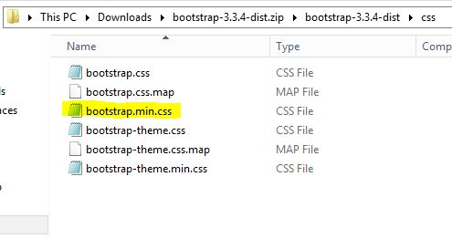

# Bootstrap Framework

### Objective

* Understand the benefits of using bootstrap
* Learn how to add bootstrap into the project
* Learn how Bootstrap Grid system work

### Reading

* [W3School - Bootstrap Grid system](http://www.w3schools.com/bootstrap/bootstrap_grid_system.asp)
* [Sitepoint - Bootstrap Grid system](http://www.sitepoint.com/understanding-bootstrap-grid-system/)

#  Instruction Plan

### Engage

In a development process nothing is more precious that **time** and having to build everything from scratch is not the best option if what we want is to save time and money. Bootstrap Libraries offer readymade pieces of code that can pump life into a website. A web developer doesn’t have to spend time laboriously working out and writing code, but simply find the right piece and fit it into the structure they’re working on. 

A great aspect of Bootstrap is that you can make it your own. You can sit down and rummage through the whole framework and keep what you need and ditch what you don’t. For that visit [Customize](http://getbootstrap.com/customize/)

Bootstrap is responsive. If you shift from a laptop to a tablet and from a tablet to a laptop you won’t have to fret over your work. Bootstrap adapts to the change in platforms with super speed and efficiency.

### Explore

Visit one the following websites and play with the size of your browser to see it change accordingly 

* http://themepixels.com/demo/webpage/quirk/templates/index.html
* http://abusinesstheme.com/demo/abt/index.html
* http://borisolhor.com/?theme=speedup_html

### Explain

#### Adding Bootstrap to your project started

To get started, download the [zip file](https://github.com/twbs/bootstrap/releases/download/v3.3.5/bootstrap-3.3.5-dist.zip). This zip file has 3 folders: CSS, js, and fonts.


Inside the CSS folder you will find six files, but we will only use `bootstrap.min.css`.



Inside the js folder you will find 3 files, but we will only use `bootstrap.min.js`.


For the fonts, we are not going to use them but if you wish to know more, visit this [page](http://getbootstrap.com/components/#glyphicons).

All you have to do is copy those files into your project's css and js folder.


#### Grid system

Bootstrap includes a responsive, mobile first fluid grid system that appropriately scales up to 12 columns according to the screen size. Grid systems are used for creating page layouts through a series of rows and columns that holds the content.

We will be making three distinctions: phone(sx), tablet(sm), and laptop(md). Now since we have 12 columns in our grid, we can make several combinations that add up to 12, for example:

```html
<!-- It is important to have a column combination encapsulated within a row to perform well -->
<!-- This will result in 3 columns. First one is 4 column, second 2 column, and third 6 column wide -->
<!-- The total of these columns adds up to 12 -->
<div class="row">
    <div class="col-sm-4">
        This is 4 columns wide
    </div>
    <div class="col-sm-2">
        This is 2 columns wide
    </div>
    <div class="col-sm-6">
        This is 6 columns wide
    </div>
</div>
```

Here is the result:


By determining the number of columns for a specific screen size, all the other screen sizes bigger than the one described will inherit that size and all the smaller sized screens will be default to a 12 column width. When you define a container element like a `div` with `class=col-sm-4`, you are setting a container 4 columns wide for small, medium, and large screen sizes and for extra small screens, it will be 12 columns wide or full width.

### Elaborate

** Very imple example **

### Evaluate
** A bit more complex* than Elaborate **

### Homework

** A bit more complex* than Evaluate **